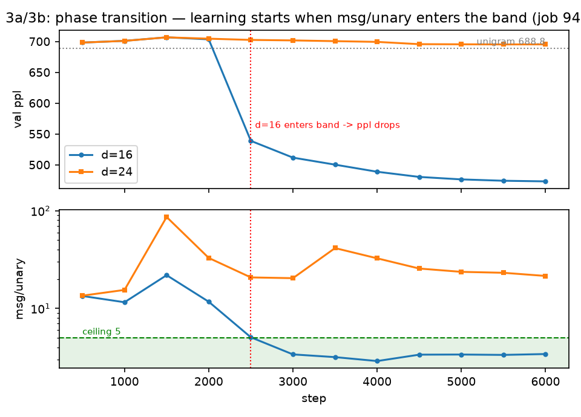
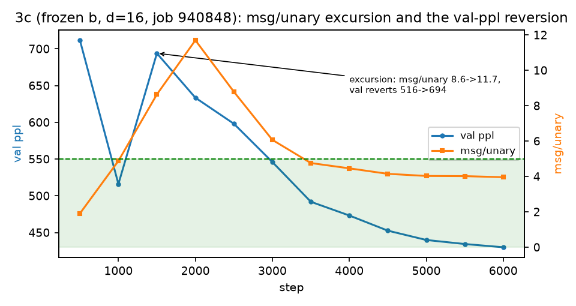
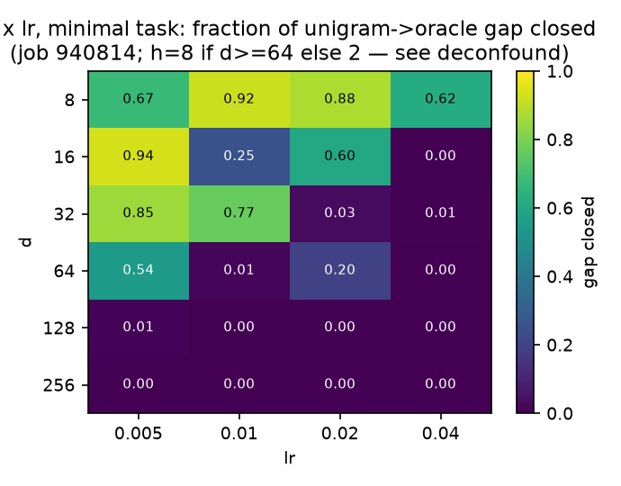
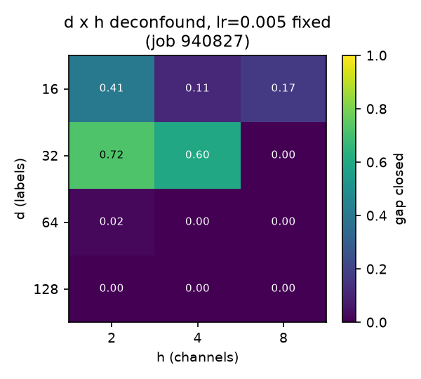
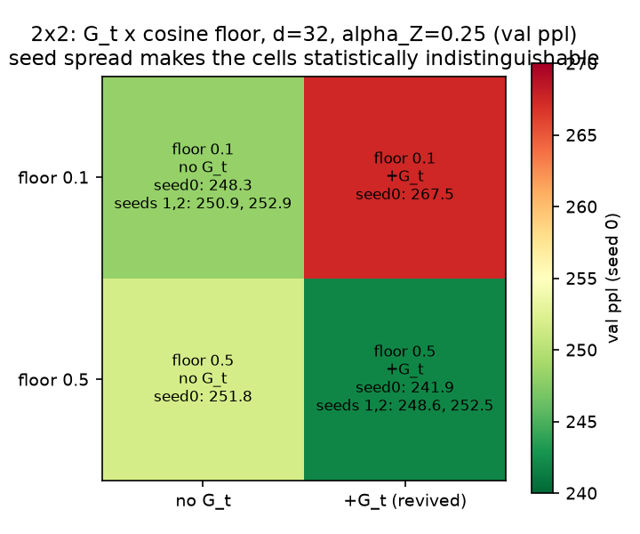
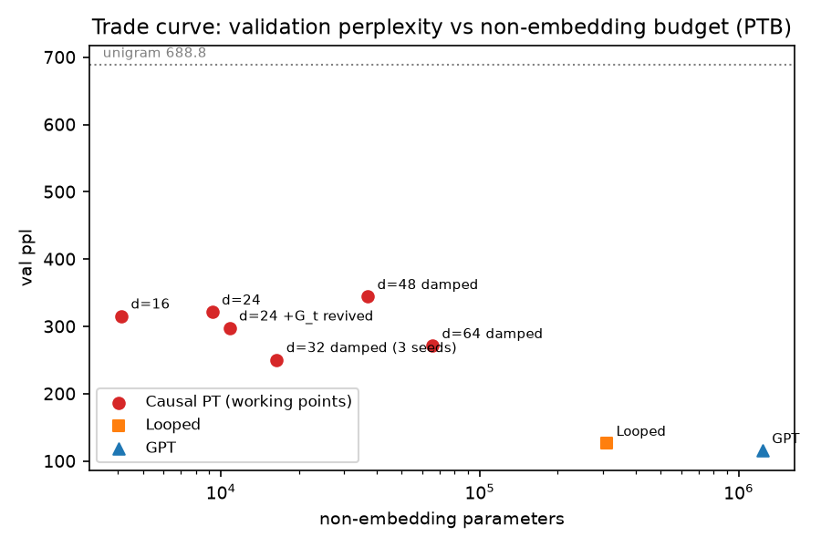

# Causal Probabilistic Transformer — full experimental report, 2026-08-09 … 2026-08-11

Audience: a colleague who has read Wu & Tu, "Probabilistic Transformers", and the causal-PT
technical note (`causalprobabilistictransformer_1.pdf`, Parts I–IV). This document is
self-contained: every experiment of the session, every number, every mechanism, and every dead
end, without reference to chat logs. Failed diagnoses are kept and marked SUPERSEDED. Every
number is sourced from a run JSON under `experiments/exp1_language_modeling/`, a slurm log
(`slurm-<jobid>.out`), a checkpoint inspection, or a committed status file; nothing is from
memory. Single-seed results are labelled as such wherever they appear.

Repository: `github.com/b3ly4ck/probabilistic-transformer-experiments`, branch `main`.
Session commit range: `ed8dda7` (v0.1.0) … `7cdcf3a` (v0.14.1), plus this report.

---

## 1. Executive summary

The causal PT decoder was implemented from scratch, validated against the worked example of
the technical note digit for digit, and trained on PTB. Final standings, identical pipeline,
identical scored token set:

| model | val ppl | test ppl | emb / non-emb params | seeds |
|---|---|---|---|---|
| **Causal PT, best** (`d=32, h=2, α_Z=0.25`, frozen `b`) | **250.69 ± 2.32** | **229.31 ± 2.62** | 330,000 / 16,448 | **3** |
| Causal PT, best single-seed cell (floor 0.5 + G_t) | 247.66 ± 5.36 | 225.52 ± 5.46 | 330,000 / 18,496 | 3 |
| Looped Transformer (1 shared block × 4) | 126.46 | 117.93 | 1,610,240 / 309,600 | 1 |
| GPT (nanoGPT, 4 layers) | 115.43 | 107.16 | 1,610,240 / 1,237,440 | 1 |
| unigram baseline | 688.82 | — | — | exact |

The PT is 2.17× worse than the GPT on validation at **75× fewer non-embedding parameters**. It
cannot currently be given a comparable budget: without damping it collapses above `d = 24`
labels and above `h = 2` channels, and with damping the `d`-ladder is non-monotone (open).
The matched-budget comparison the research plan requires therefore does not exist yet; the
honest object is the trade curve of Fig. 6, which is what §22.3 of the technical note
anticipated.

Three mechanisms were established:

1. **The message/unary balance decides learning, and the transition is visible within a run.**
   The scalar `msg/unary = ‖G_i‖ / ‖S_{w_i,·}‖` (head message against word unary in the
   content stream) separates every run that learns from every run that lands on the unigram,
   across ~30 PTB runs without exception. In run 940844 the model sits at the unigram for
   2000 steps and validation perplexity drops 703.6 → 539.0 at the very evaluation where
   `msg/unary` first enters the healthy range; in run 940848 an excursion out of the range at
   steps 1500–2000 coincides with perplexity *reverting* 516 → 694, then resuming its fall
   when the scalar re-enters. The dependence is two-sided (Fig. 1, Fig. 2).
2. **A step size below 1 on the label update (Wu & Tu App. B.1) breaks the runaway loop and
   opens `d = 32`.** The loop `q̄ → B → G → q̄` explodes at `d = 32` (`msg/unary` 2.88 → 20.57
   between steps 500 and 1000); `α_Z = 0.25` damps it and takes validation perplexity from
   315.46 (`d = 16` ceiling) to 250.69 ± 2.32. This is the largest single gain of the session
   and is replicated over three seeds. `α_Z = 0.5` is not enough (531.10, single seed).
3. **The B.3.3 global head dies by a symmetry trap and revives only when treated unlike the
   other factors.** Under uniform initialisation and a shared L2, the rows of `B'` collapse to
   one row replicated `m` times (row spread 0.0197 → 0.0037 while within-row structure stays
   0.90); the gradient argument is two lines (§5.5). With asymmetric initialisation and no L2
   on `B'` the head carries half the total message and improves an undamped `d = 24` by 7.4 %.
   On the damped record it *costs* 7.7 % and doubles the seed variance. Both readouts defeat
   it for different reasons: under the exact readout its contribution is a constant by
   construction (measured to 1e-12); under MFVI it is degenerate by optimisation unless
   specially treated.

**Interaction claim, withdrawn.** On single seeds, `G_t` + a raised cosine floor beat the
record (241.89 vs 248.29) while each intervention alone was worse — an apparent interaction.
Replication over three seeds gives 247.66 ± 5.36 against 250.69 ± 2.32: a 1.2 % difference
against overlapping ranges. The single-seed record of 241.89 is withdrawn; the defensible
number is the damped `d = 32` figure above.

---

## 2. Setup

### 2.1 Data

PTB word level, Mikolov preprocessing (lower-cased, numbers → `N`, OOV → `<unk>`), one
sentence per line, `<eos>` appended per line. Vocabulary built from train: **10,000 types**.
Token counts: train **929,589**, valid **73,760**, test **82,430** (matches the published
corpus). Batches are fixed-length blocks of 64 tokens cut from the `<eos>`-joined stream —
the nanoGPT convention — identical for every model.

**Unigram floor.** Maximum-likelihood unigram from train counts (no smoothing; the vocabulary
is built from train so no zero count can occur), scored on the identical token set as the
models (deterministic non-overlapping validation blocks, first slot dropped):
**val 688.82** (687.45 with the first slot included). Every "gate" in this report is defined
against 688.82; the pre-registered pass criterion was val below half of it (344.41).

### 2.2 Evaluation protocol

- **Slot alignment.** PT's `logits[:, t]` predicts `w_t` from `w_{<t}`; slot 0 is predicted
  from ROOT alone. A GPT trained conventionally emits `logits[:, t]` predicting `w_{t+1}`.
  The GPT wrapper runs the backbone on `idx[:, :-1]` and shifts its output right by one slot,
  so both models answer `p(w_t | w_{<t})`; slot 0 of the GPT is returned as zeros and its
  `loss()` asserts it is never scored.
- **`ignore_first = 1` everywhere.** PT scores `n` tokens per block (including a first-word
  unigram prediction the baseline never makes), a GPT scores `n − 1`. Dropping slot 0 makes
  the scored token sets identical; the equality of token counts is asserted by a test.
- **Deterministic evaluation**: fixed non-overlapping blocks in corpus order, whole split.
  Training perplexity is additionally measured on a fixed 20-batch slice of train, the same
  deterministic way (from v0.9.0 on).
- **Prefix ablation** (context probe): at the last slot of each validation block, compare the
  predictive distribution under the true prefix vs the same tokens shuffled vs the prefix
  replaced by one repeated token; report mean KL, max |Δlogit|, and argmax agreement.

### 2.3 Shared training loop

One implementation (`src/train.py`) used by every model; model-specific behaviour is reached
only through `loss(idx, ignore_first)`, `arc_regulariser()`, `num_parameters()`. AdamW,
β = (0.9, 0.999), weight decay 1.4e-6 (Wu & Tu Table 2, PTB), gradient clip 1.0, linear
warmup 100 steps then cosine decay to `min_lr_frac × lr` (0.1 unless stated), L2 on the arc
scores 5e-4 (Table 2) applied via `arc_regulariser()`. Dropout is **not** implemented for PT
(its placement inside the update equations is unspecified in the source and any placement
would cross the §22.2 "no maps" tripwire); the GPT baseline also ran with dropout 0.0.

### 2.4 PT configuration fields

`d` = label-set size of `Z_t`; `h` = number of head channels `H^(c)`; `rank` = Kruskal rank of
`T^(c) = U^(c)V^(c)ᵀ` (Wu & Tu Eqs. 14/21); `γ` = RPE clip threshold, causal half only, so
`γ+1` distance buckets (Eqs. 9/10); `T` (`n_iters`) = content-stream MFVI iterations,
layer-parallel schedule; `τ` = predictive inner rounds of the MFVI readout; `λ_Z = 1`,
`λ_H = 1/d` (§2.3.3, App. A.5), `λ_W = 1`, `λ_G = 1` (unpinned by the source; set = `λ_Z`);
`α_Z` = App. B.1 step size on the label update (1 = original model, asserted bitwise);
`init_std = 0.02` (nanoGPT convention; specified by neither paper), `root_init_std = init_std`
unless stated; `freeze_b` = clamp the word unary to corpus log-frequencies, never updated;
`n_global` = `m` of the B.3.3 single-split global head (0 = off).

### 2.5 Hardware and cluster

Slurm partition `critical`; NVIDIA TITAN RTX (24 GB) or A40 (46 GB) per job as listed in the
reproduction table; `/public/software/anaconda3` python 3.8.8, torch 2.0.1+cu117. Nodes
`ai_gpu32` and `ai_gpu33` do not mount `/public` and silently kill jobs (see §7, corrections).

### 2.6 Headline configurations, full dumps

| field | pilot MFVI | GPT | Looped | 3a `d=16` | ladder `d=16` | **record `d=32`** | `G_t` revived `d=24` | 2×2 best cell |
|---|---|---|---|---|---|---|---|---|
| job(s) | 940422 | 940799 | 940799 | 940844 | 940858 | 940914, 940932, 940934 | 940918 | 940921, 940931, 940933 |
| result JSON | pilot_mfvi_T3 | base_gpt | base_looped | attack | attack_final | damp_d32_a0.25, RECseed1/2 | G_rev_d24 | full_d32, Bseed1/2 |
| `d` / `h` / `rank` / `γ` | 256 / 8 / 64 / 3 | n_embd 160, L4, H4 | same, 1 shared block | 16 / 2 / 16 / 3 | 16 / 2 / 16 / 3 | 32 / 2 / 32 / 3 | 24 / 2 / 24 / 3 | 32 / 2 / 32 / 3 |
| `T` / `τ` / readout | 3 / 2 / mfvi | — | — | 3 / 2 / mfvi | 3 / 2 / mfvi | 3 / 2 / mfvi | 3 / 2 / mfvi | 3 / 2 / mfvi |
| `λ_Z` / `λ_H` / `λ_G` / `λ_W` | 1 / 1/256 / 1 / 1 | — | — | 1 / 1/16 / 1 / 1 | 1 / 1/16 / 1 / 1 | 1 / 1/32 / 1 / 1 | 1 / 1/24 / 1 / 1 | 1 / 1/32 / 1 / 1 |
| `α_Z` | 1.0 | — | — | 1.0 | 1.0 | **0.25** | 1.0 | 0.25 |
| `n_global` (`m`) | 0 | — | — | 0 | 0 | 0 | 64, init 0.5, no L2 on `B'` | 64, init 0.5, no L2 on `B'` |
| `freeze_b` | no | — | — | no | **yes** | **yes** | yes | yes |
| lr / warmup / floor / steps | 1e-3 / 100 / 0.1 / 6000 | 1e-3 / 100 / 0.1 / 6000 | same | 2e-2 / 100 / 0.1 / 6000 | 2e-2 / 100 / 0.1 / 15000 | 2e-2 / 100 / 0.1 / 15000 | 2e-2 / 100 / 0.1 / 15000 | 2e-2 / 100 / **0.5** / 15000 |
| batch / block | 16 / 64 | 16 / 64 | 16 / 64 | 16 / 64 | 16 / 64 | 16 / 64 | 16 / 64 | 16 / 64 |
| init_std / root_init_std | 0.02 / = | 0.02 | 0.02 | 0.02 / = | 0.02 / = | 0.02 / = | 0.02 / = (B' 0.5) | 0.02 / = (B' 0.5) |
| l2_arc / wd / clip | 5e-4 / 1.4e-6 / 1.0 | 0 / 1.4e-6 / 1.0 | same | 5e-4 / 1.4e-6 / 1.0 | same | same | same (B' excluded n/a) | same (B' excluded) |
| seed(s) | 0 | 0 | 0 | 0 | 0 | 0, 1, 2 | 0 | 0, 1, 2 |
| params emb / non-emb | 2,570,000 / 1,050,624 | 1,610,240 / 1,237,440 | 1,610,240 / 309,600 | 170,000 / 4,128 | 170,000 / 4,128 | 330,000 / 16,448 | 250,000 / 10,800 | 330,000 / 18,496 |
| wall-clock | 308 s | 123 s | 116 s | 203 s | 483 s | 656 / 536 / 538 s | 546 s | 626 / 594 / 687 s |
| hardware | TITAN RTX | A40 | A40 | A40 | A40 | TITAN RTX | TITAN RTX | TITAN RTX |
| val / test | 695.70 / 655.09 | 115.43 / 107.16 | 126.46 / 117.93 | 473.28 / 433.06 | 315.46 / 285.33 | 250.69±2.32 / 229.31±2.62 | 297.71 / 272.82 | 247.66±5.36 / 225.52±5.46 |

---

## 3. Baselines

Both baselines ran in job 940799 (A40), 6000 steps, identical loop, blocks, token set and
unigram reference. GPT is nanoGPT off the shelf: pre-LayerNorm causal transformer, learned
positional embeddings, 4× GELU MLP, tied embeddings, `n_embd=160, n_layer=4, n_head=4`.
Looped is the same with one shared block applied 4 times (Experiment 2's construction:
PT's weight sharing without PT's structure).

| model | val | test | emb / non-emb | prefix ablation (shuffled): KL / max\|Δlogit\| / argmax same |
|---|---|---|---|---|
| GPT | 115.43 | 107.16 | 1,610,240 / 1,237,440 | 3.9461 / 14.04 / 0.117 |
| Looped | 126.46 | 117.93 | 1,610,240 / 309,600 | 3.6469 / 14.91 / 0.125 |
| PT control (`d=256,h=8`, lr 1e-3) | 695.84 | 655.25 | 2,570,000 / 1,050,624 | 0.0000 / 0.0000 / 1.000 |

What each certifies:

- **GPT at 115.43 exonerates the pipeline.** The loop, data, evaluation, and slot alignment
  produce a competitive number (the predecessor implementation's own GPT reached 131 on its
  own pipeline), so every PT failure below is PT's.
- **Looped at 126.46 exonerates weight sharing.** It has PT's parameter sharing, none of its
  structure, 3.4× fewer non-embedding parameters than the PT control, and it works. Weight
  sharing costs ~10 % against the GPT; it does not cost a factor of six.
- **The ablation row for PT is the failure in one line**: the trained PT control's output does
  not depend on the prefix at all — KL exactly 0.0000 at float precision, argmax never moves.

---

## 4. The failure and its diagnosis

### 4.1 The sweep: every early configuration lands on the unigram

Base config: `d=256, h=8, rank=64, γ=3, T=3, τ=2`, MFVI readout, lr 1e-3, 6000 steps
(exact-readout run: 2000), seed 0. Unigram 688.82.

| job | change from base | val | test | wall | HW |
|---|---|---|---|---|---|
| 940422 | none (pilot) | 695.70 | 655.09 | 308 s | TITAN |
| 940423 | exact readout, 2000 steps | 1555.04 | 1508.89 | 794 s | TITAN |
| 940436 | `T=1` | 695.33 | 654.60 | 181 s | TITAN |
| 940435 | `l2_arc = 5.0` | 691.82 | 649.88 | 307 s | TITAN |
| 940438 | `λ_Z = 4` | 690.02 | 646.51 | 230 s | A40 |
| 940483 | `λ_Z = 16` | 696.24 | 655.82 | 287 s | TITAN |
| 940484 | `λ_Z = 32` | 697.76 | 657.63 | 261 s | TITAN |
| 940485 | `λ_Z = 64` | 699.29 | 659.42 | 228 s | A40 |
| 940444 | word unary `b` removed | 985.02 | 945.01 | 291 s | TITAN |
| 940445 | control for 940444 | 695.73 | 655.10 | 264 s | TITAN |
| 940489 | `init_std = 0.2` | 695.53 | 654.86 | 298 s | TITAN |
| 940490 | `init_std = 0.5` | 702.57 | 660.80 | 263 s | TITAN |
| 940502 | `τ = 1` (init 0.5) | 700.45 | 659.64 | 258 s | TITAN |
| 940503 | `τ = 4` (init 0.5) | 696.00 | 653.52 | 347 s | TITAN |
| 940504 | `τ = 8` (init 0.5) | 709.45 | 668.56 | 434 s | A40 |

Fifteen configurations spanning 45× in `λ_Z`, 10⁴× in the L2 coefficient, 25× in `init_std`,
`T` ∈ {1,3}, `τ` ∈ {1,2,4,8}, `b` on/off, both readouts: every MFVI run within 1–3 % of the
unigram; the exact readout more than twice above it. Perplexity falls (5692 → 695 within run
940422) but falls *to* the unigram.

Diagnoses raised and killed, in order:

- **SUPERSEDED — "`b` is a shortcut to the unigram."** Removing `b` (940444) made the model
  *worse* (985 vs 696): the context path does not wake when the cheap route to the marginal
  is removed. (Note dropping `b` never made the unigram unreachable: with `μ` constant,
  `logits(w) = LSE_a(S_{w,a} + log μ(a))` is still a function of `w` alone.)
- **SUPERSEDED — "the label softmax saturates" (`‖G‖=45` vs `‖s̄‖=0.74`, entropy 0.0009 nats).**
  Prediction registered in advance: raising `λ_Z` should recover the entropy *and* make the
  ablation KL non-zero. Measured: entropy recovered fully (0.044 → 4.95 → 5.26 → 5.48 nats at
  `λ_Z` = 1/16/32/64) and perplexity did not move (695.73 / 696.24 / 697.76 / 699.29), the
  ablation KL stayed exactly 0. The model traded a uniform-everywhere posterior for a
  one-hot-everywhere posterior; the position-variance of `q̄` *worsened* (3.0e-5 → 3.9e-11).
- **SUPERSEDED — "the initialisation is context-blind."** True as a measurement — an untrained
  model at `init_std=0.02` has ablation KL 9.5e-11 while at 0.5 it has 6.9e-2 with the argmax
  moving on 62 % of slots — but training from the context-using initialisation still landed on
  the unigram (702.57, job 940490). Not the binding constraint.
- **The identity that closes the case.** In every failing run `q̄` is nearly identical across
  positions (std 0.0008–0.0013 against uniform 1/256 = 0.0039). If `q̄_j` is the same for all
  `j`, then `B^(c)_{j,a}` is the same for all `j`, and
  `log μ_t(a) = Σ_c LSE_{j∈D_t} B^(c)_{j,a} = Σ_c [B^(c)_a + log|D_t|]`;
  the `log|D_t|` term is constant in `a` and is removed exactly by the readout's
  normalisation. The logits then cannot depend on the prefix content — only on `t` — and the
  model is left with `p(w | position in block)`, whose average is the unigram. Measured
  directly: logits vary 1700× more across slots than across sequences (std 1.5e-1 vs 8.9e-5).

### 4.2 Stage-by-stage content fraction: no single guilty stage

Content fraction = std over sequences at a fixed slot ÷ overall std (scale-free). Control:
an *untrained* model at `init_std = 0.5`, whose readout demonstrably works (ablation KL
6.9e-2).

| stage | untrained 0.5 | trained init 0.5 | trained `λ_Z=16` | trained baseline |
|---|---|---|---|---|
| `q̄` (content stream) | 3.10e-01 | 3.61e-02 | 5.18e-02 | 9.10e-04 |
| `B` (contracted arcs) | 7.68e-01 | 2.41e-01 | — | 2.74e-03 |
| `G` round 1 | 6.28e-01 | 4.75e-01 | **6.00e-05** | 3.08e-03 |
| `Q_Z` round 1 | 3.22e-01 | **5.87e-04** | 6.52e-05 | 7.15e-09 |
| logits | **7.35e-01** | 9.33e-05 | 2.98e-09 | 1.33e-08 |

The architecture transmits word identity end to end (control column). Every trained model
ends at 1e-5…1e-9, but the content dies at *different* stages per configuration — at the
`Q_Z` softmax in one, already inside the message in another, already in `q̄` in the third.
Training removes the content by whichever route is available; no single operation is broken.

### 4.3 Scale bisection with GPT control — SUPERSEDED as a scale story

Order-1 Markov chain, 5 successors/state, Dirichlet(1) transition rows; oracle =
visit-weighted mean conditional entropy; unigram with add-1 smoothing. 3000 steps, lr 1e-3
(the then-default). "Gap closed" = (unigram − best) / (unigram − oracle). Job 940799.

| cell | oracle | unigram | GPT gap closed | PT gap closed |
|---|---|---|---|---|
| V=11, d=256 | 3.71 | 7.84 | 1.149 | 0.000 |
| V=100, d=256 | 3.65 | 81.19 | 1.001 | 0.000 |
| V=1000, d=256 | 3.61 | 795.42 | 1.000 | 0.000 |
| V=10000, d=256 | 3.61 | 7945.95 | 1.000 | 0.018 |
| V=1000, d=16 | 3.61 | 795.42 | 0.984 | 0.062 |
| V=1000, d=64 | 3.61 | 795.42 | 1.000 | 0.044 |
| V=1000, d=256 (dup) | 3.61 | 795.42 | 1.000 | 0.000 |

(GPT > 1 is possible because the oracle is an estimate, not a bound.) The hypothesis "the
failure is scale-dependent" is **SUPERSEDED**: PT extracts essentially nothing at *any*
vocabulary and *any* width **at lr 1e-3**, including `V = 11` where the next token is fixed
by one preceding symbol out of eleven, while GPT reaches the oracle in every cell. What
replaced it: the failure is *joint* in `(d, lr)` — §4.4.

### 4.4 The lr probe and the d × lr grid

lr probe (job 940809, TITAN RTX; chain oracle 3.84 / unigram 6.52, pre-v0.8.2 chain):

| lr | 0.001 | 0.005 | 0.02 | 0.05 | 0.1 |
|---|---|---|---|---|---|
| PT `d=16`, gap closed | 0.069 | 0.546 | **1.011** | 0.000 | 0.009 |
| PT `d=256` | 0.000 | 0.000 | 0.000 | 0.000 | 0.115 |
| GPT `d=256` (control) | 1.350 | 1.350 | 1.323 | 0.849 | 0.321 |

At `d=16, lr=0.02` the PT reaches the oracle (3.809 vs 3.84). PT needs a rate 20× above the
Table 2 value — at which the GPT is already degrading — and it needs the small width at that
rate. All fifteen sweep configurations of §4.1 sat outside this region on both axes at once.

d × lr grid (job 940814, A40; different chain instance, oracle 1.96 / unigram 3.09 —
pre-v0.8.2, fractions comparable, raw perplexities not), Fig. 3:

| `d` \ lr | 0.005 | 0.01 | 0.02 | 0.04 |
|---|---|---|---|---|
| 8 | 0.672 | 0.919 | 0.878 | 0.620 |
| 16 | **0.936** | 0.254 | 0.604 | 0.000 |
| 32 | 0.852 | 0.767 | 0.029 | 0.006 |
| 64 | 0.544 | 0.012 | 0.196 | 0.000 |
| 128 | 0.011 | 0.000 | 0.001 | 0.000 |
| 256 | 0.000 | 0.000 | 0.000 | 0.000 |

Replication of the best cell (`d=16, lr=0.005`) over seeds 0/1/2: gap closed 0.936 / 0.886 /
0.780 — 2 of 3 above 0.8; the shortfall seed is the one whose `msg/unary` left the healthy
range (5.67 vs 2.86/2.87). Caveat: this grid varied `h` together with `d`
(`h = 8 if d ≥ 64 else 2`), deconfounded next.

### 4.5 The d × h deconfound

Full cross grid, lr fixed at 0.005, one chain (oracle 3.577 / unigram 7.105, post-v0.8.2),
seed 0, 3000 steps/cell, job 940827 (A40). Fig. 4.

| `d` | `h` | val ppl | train ppl | gap closed | msg/unary | H(q) | ablation KL |
|---|---|---|---|---|---|---|---|
| 16 | 2 | 5.675 | 7.006 | 0.405 | 8.56 | 0.122 | 6.93e-02 |
| 16 | 4 | 6.715 | 6.671 | 0.110 | 18.81 | 0.089 | 1.45e-01 |
| 16 | 8 | 6.502 | 6.462 | 0.171 | 15.52 | 0.118 | 1.59e-01 |
| 32 | 2 | 4.551 | 4.485 | **0.724** | 6.78 | 1.796 | 9.31e-01 |
| 32 | 4 | 5.003 | 4.921 | 0.596 | 8.21 | 0.950 | 6.80e-01 |
| 32 | 8 | 7.104 | 7.047 | 0.000 | 36.68 | 0.083 | 0.000 |
| 64 | 2 | 7.023 | 6.974 | 0.023 | 22.77 | 1.079 | 1.69e-04 |
| 64 | 4 | 7.103 | 7.044 | 0.001 | 43.48 | 0.105 | 0.000 |
| 64 | 8 | 7.106 | 7.051 | 0.000 | 47.51 | 0.047 | 0.000 |
| 128 | 2 | 7.106 | 7.050 | 0.000 | 12.21 | 0.156 | 0.000 |
| 128 | 4 | 7.106 | 7.051 | 0.000 | 28.39 | 0.118 | 0.000 |
| 128 | 8 | 7.106 | 7.051 | 0.000 | 25.78 | 0.036 | 0.000 |

Channels degrade the model monotonically at every width (at `d=32`: 0.724 → 0.596 → 0.000 as
`h` = 2 → 4 → 8, with `msg/unary` 6.78 → 8.21 → 36.68). Width degrades it independently of
channels (at `h=2`: 0.405 → 0.724 → 0.023 → 0.000). Neither effect may be attributed to the
other; the width optimum on this chain is `d=32`, not the smallest width. The message bound
behind the channel effect, in one line: `G_i(a) = Σ_c Σ_{j∈D_i} Q_c(j) B^(c)_{j,a}` with
`Q_c` a distribution and each `B^(c)_{j,·}` an expectation of a row of `T^(c)` under `q̄_j`
(ROOT row = `r^(c)`), hence `|G_i(a)| ≤ h · max(max|T|, max|r|)` — linear in `h`,
independent of `d`.

---

## 5. The fixes, in causal order

All PTB, `h = 2`, MFVI readout, lr 0.02, warmup 100, seed 0 unless stated.

### 5.1 Freeze `b` at the corpus log-unigram

Mechanism: `b_w` is a free per-word parameter that represents the unigram exactly, so the
fastest descent direction is to fit the marginal through `b` while the context path idles —
the 940844 trace shows the model sitting at the unigram for the first 2000 steps. Prepaying
the marginal (set `b = log p̂_unigram`, never update; the factor stays in the graph, observed
rather than learned) removes the race.

| run | job | steps | `b` | val | train | test | msg/unary | ablation KL |
|---|---|---|---|---|---|---|---|---|
| 3a | 940844 | 6000 | learned | 473.28 | 488.85 | 433.06 | 3.41 | 0.913 |
| 3c | 940848 | 6000 | frozen | 430.04 | 450.35 | 393.09 | 3.96 | 0.799 |

−9.1 % val at identical budget (single seeds). The phase transition moves from step 2500 to
step 1000. The excursion trace (Fig. 2): `msg/unary` rises to 8.64 and 11.70 at steps
1500–2000 and validation perplexity *reverts* 516.1 → 693.9, then falls monotonically to
430.0 once the scalar re-enters the range — the two-sided evidence that the balance, not the
budget, is what gates learning at this stage. Freezing `b` also lifts the label entropy from
0.030 to 0.870 (of 2.77): the free `b` was driving `q̄` into degeneracy, not merely wasting
steps.

### 5.2 Budget, with the schedule caveat

| run | job | steps | `b` | val | train | test | msg/unary | ablation KL |
|---|---|---|---|---|---|---|---|---|
| budget | 940850 | 15000 | learned | 336.89 | 338.90 | 308.04 | 1.09 | 1.873 |
| both | 940858 (`d=16`) | 15000 | frozen | 315.46 | 314.09 | 285.33 | 0.98 | 2.182 |

The 15000-step run ends flat (last four evals 339.19 / 338.84 / 336.89 / 337.21) where 6000
steps cut the descent mid-fall. **Caveat, unresolved:** the cosine schedule is defined over
`max_steps`, so the long run is not "the same run, longer" — at step 6000 its lr is still
high while the short run has decayed to 0.1×. Budget and schedule are not separated by these
runs; a fixed-lr run would separate them and was not performed. The two interventions
compose: 473.28 → 430.04 (freeze) → 336.89 (budget) → 315.46 (both). All single seeds.

First `d`-ladder at this configuration (job 940858): `d=16` 315.46; `d=24` 321.43 / train
325.84 / test 294.89 / msg 2.26 / KL 2.003; `d=32` **final 641.5** (train 664.95, test
582.92, msg 5.33, KL 0.281) — the stored `val_ppl` 523.08 for that row is the *minimum* over
the trace, reached at step 500 before the message exploded; see corrections (§7).

### 5.3 Damping (`α_Z < 1`) breaks the runaway loop and opens `d = 32`

The loop: larger `T` → sharper attention → the message becomes a full-magnitude `B` row →
`q̄` sharpens → `T` grows further. At `d=32, α_Z=1` it runs away within the run
(msg/unary 2.88 at step 500 → 20.57 at step 1000, val 523 → 769, never recovers). App. B.1
step size `Q^(t) = α_Z Q* + (1−α_Z) Q^(t−1)` on the label update damps exactly this loop;
`α_Z = 1` reproduces the original update bitwise (asserted).

| run | job | HW | val (final) | train | test | msg/unary | ablation KL | non-emb |
|---|---|---|---|---|---|---|---|---|
| `d=32, α_Z=1` | 940858 | A40 | 641.5 | 664.95 | 582.92 | 5.33 | 0.281 | 16,448 |
| `d=32, α_Z=0.5` | 940913 | TITAN | 531.10 | 554.91 | 483.35 | 4.90 | 0.701 | 16,448 |
| **`d=32, α_Z=0.25`** | 940914 | TITAN | **248.29** | 225.43 | 226.62 | 1.31 | 2.851 | 16,448 |
| `d=48, α_Z=0.25` | 940915 | TITAN | 344.31 | 354.42 | 315.90 | 2.89 | 1.668 | 36,960 |
| `d=64, α_Z=0.25` | 940916 | TITAN | 271.41 | 253.69 | 249.64 | 2.56 | 2.694 | 65,664 |

Replication of the record over seeds 1/2 (jobs 940932/940934): 250.86 / 252.93 → **250.69 ±
2.32 val, 229.31 ± 2.62 test over three seeds.** The ablation KL rises 2.182 → 2.851: more
context used, not merely a better score. `train < val` for the first time in the project
(225.43 vs 248.29): the model crosses from underfitting into overfitting, making
regularisation meaningful for the first time.

The threshold sits between 0.5 and 0.25: at 0.5 the damping stalls learning as well as the
explosion (msg/unary dips to 0.99 by step 1500, `max|T|` oscillates 0.81 → 0.34 → 3.16, the
run holds at ~710 for 1500 steps, and `arc_msg_norm` still ends at 46.3). The ladder above
`d = 32` at fixed `α_Z = 0.25` is **non-monotone** (48 worst, and the only damped run with
`train > val` and a depressed ablation KL): read as "what `α_Z = 0.25` does across widths",
not as a ceiling — `α_Z` was selected at `d = 32` and the loop it damps grows with `d`. The
ceiling under damping is open (§6).

### 5.4 The cosine floor, and the 2×2

Raising `min_lr_frac` 0.1 → 0.5 was motivated by the record's tail (`msg/unary` 0.98–1.31 at
the end, possibly over-damped by the decayed lr). Because the first floor run carried `G_t`
in simultaneously, the full 2×2 was completed (Fig. 5); all cells `d=32, α_Z=0.25`, frozen
`b`, 15000 steps:

| val / test (seed 0) | no `G_t` | with `G_t` (revived form) |
|---|---|---|
| floor 0.1 | 248.29 / 226.62 (940914) | 267.51 / 245.69 (940920) |
| floor 0.5 | 251.80 / 230.80 (940927) | 241.89 / 219.95 (940921) |

On seed 0: each intervention alone is worse (`G_t` +7.7 %, floor +1.4 %) and the pair is
better (−2.6 %) — an apparent interaction. **Replication (seeds 1/2, jobs 940931/933 vs
940932/934):** best cell 248.61 / 252.48 → 247.66 ± 5.36; record cell 250.86 / 252.93 →
250.69 ± 2.32. The 1.2 % mean difference is inside the overlapping spreads, and the `G_t`
cell has **twice the seed variance**. The interaction claim and the 241.89 record are
**withdrawn**; what survives of the 2×2 at replication strength is only that `G_t` at floor
0.1 hurts (+7.7 %, outside spread).

### 5.5 The global head `G_t`, end to end

**Form verification (before any run).** B.3.3 single-split per Wu & Tu Eq. 46: one
`B' ∈ R^{m×d}`, no channel axis, one `G_i` per word; the message
`σ(q B'ᵀ / λ_G) B'` (the GFU operator, Eq. 62) is added once per round, not once per
channel — asserted behaviourally (identical message under `h=2` and `h=8` with equal `B'`).
`B'` was added to the L2 term alongside `T` and `r` (the root-column lesson: an unpenalised
carrier absorbs the message).

**Exact-readout exclusion.** Under the exact readout the head's direct contribution is
`log μ_t(a) += LSE_k B'_{k,a}` — a position- and prefix-independent `d`-vector, measured
constant to 1e-12. A run in that mode measures a label prior, not a feed-forward analogue;
the config refuses `n_global > 0` with the exact readout. All `G_t` runs are MFVI.

**First death (uniform treatment).** Jobs 940872 (`d=16, m=64`) and 940879 (`d=24, m=64`),
`B'` init 0.02, `B'` in the L2:

| config | val | train | test | H(Q_g)/max | glob msg | arc msg | `B'` row spread vs init |
|---|---|---|---|---|---|---|---|
| `d=16` no `G_t` | 315.46 | 314.09 | 285.33 | — | — | — | — |
| `d=16` `m=64` | 348.59 | 350.14 | 315.33 | 1.0000 | 3.54 | 10.44 | 0.19× (collapsed) |
| `d=24` no `G_t` | 321.43 | 325.84 | 294.89 | — | — | — | — |
| `d=24` `m=64` | 316.42 | 308.24 | 287.81 | 0.9995 | 3.10 | 22.39 | 9.68× |

At `d=16` the checkpoint shows the trap exactly: within-row structure large (std 0.904),
across-row spread **fallen** from 0.0197 at init to 0.0037; the logit range over the 64
features under a one-hot `q` is 0.05, so `Q_g` is uniform to four decimals throughout. The
gradient argument in two lines: with `Q_g` uniform the message is the row mean, so
`∂message/∂B'[k] = 1/m`, identical for every `k`; the only row-distinguishing term enters
through the softmax Jacobian and is of the order of the row spread itself — and the shared
L2 shrinks that spread further. A self-locking degeneracy from any near-symmetric start.

**Revival (both locks removed).** Job 940918: `B'` init std 0.5, `B'` excluded from the L2,
`d=24, m=64`, no damping:

| config | val | train | test | H(Q_g)/max | glob msg | arc msg | ablation KL |
|---|---|---|---|---|---|---|---|
| `G_t` revived | **297.71** | 292.26 | **272.82** | **0.9079** | **18.59** | 18.49 | 2.391 |

The head carries half the total message and improves `d=24` by 7.4 % val / 7.5 % test
(single seed). Verdict on §22.2 turns conditional: the head is not inherently dead weight —
it works, but only when initialised and regularised *unlike the other factors of the graph*;
under the uniform treatment the source itself applies, it is guaranteed to die.

**Re-collapse under damping.** In the 2×2 cells (jobs 940920/940921) the same revived head
partially re-collapses: H(Q_g)/max 0.9886 / 0.9741 (seed 1 of the best cell: 0.7708; seed 2:
0.9484) against 0.9079 undamped. Damping slows `q̄`, and the gradient through `q̄` is the only
row-separating term — moves 5.3 and 5.5 compete for the same dynamics rather than composing.
On the damped record the head costs 7.7 % (267.51 vs 248.29, seed 0) and doubles the seed
variance of the final number.

### 5.6 Readout comparison record

- PTB, `d=256` base config: exact readout **1555.04 val / 1508.89 test** after 2000 steps
  (794 s) vs MFVI 695.70 / 655.09 after 6000 steps (308 s), both TITAN RTX — per-step the
  exact readout cost ~7.8× here (397 vs 51 ms/step).
- The predecessor implementation (commit `57118de`, before the rewrite) recorded 78× per-step
  (1832 vs 23.6 ms/step) with its chunked exact readout at `d=256` — kept for the record;
  not directly comparable to this implementation.
- Worked-example contrast (§5 of the technical note, reproduced digit for digit in this
  implementation): on the same slot the MFVI readout gives `p̂(W₄) = (.460, .267, .007, .267)`
  and the exact readout `(.365, .215, .206, .215)` — the exact (mixture-of-softmaxes) readout
  is visibly flatter, consistent with it escaping the mean-field mode-seeking.
- No trained side-by-side of the two readouts in the working region exists yet (Experiment 3
  proper remains open).

---

## 6. What is established vs. open

### Established

| claim | strongest evidence | replication |
|---|---|---|
| The pipeline is sound; the failures were PT's | GPT 115.43 on the identical loop/token set (940799) | 1 seed, but certifying, not comparative |
| Weight sharing is not the failure | Looped 126.46 at 309,600 non-emb params | 1 seed |
| Early PT lands on the unigram across a 15-config sweep | §4.1 table; ablation KL exactly 0.0000 | many configs, 1 seed each |
| The failure is the loss of cross-sequence content, not one broken stage | content-fraction table §4.2; untrained control carries 0.73 to the logits | 4 checkpoints |
| The `log\|D_t\|` identity forces the unigram once `q̄` is position-flat | §4.1 identity + logits varying 1700× more across slots than sequences | analytic + 1 measurement |
| The working region is joint in `(d, lr)` | §4.4 grids; oracle reached at `d=16, lr=0.02` on the minimal task | best cell replicated 3 seeds (0.94/0.89/0.78) |
| Channels and width degrade the model independently | §4.5 cross grid at fixed lr | 1 seed/cell |
| `msg/unary` separates learning from unigram outcomes | every PTB run in this report; within-run transition (Fig. 1) and two-sided excursion (Fig. 2) | ~30 runs, incl. all replicated ones |
| Freezing `b` at log-unigram helps and moves the transition earlier | 473.28 → 430.04; transition step 2500 → 1000 | **1 seed** |
| Damping `α_Z=0.25` opens `d=32`; largest single gain | 641.5 → 248.29; record 250.69 ± 2.32 / 229.31 ± 2.62 | **3 seeds** |
| `α_Z=0.5` is insufficient | 531.10, stall evidence §5.3 | 1 seed |
| `G_t` dies by row-collapse under uniform treatment | checkpoint spreads 0.0197 → 0.0037; gradient symmetry argument | 2 configs, 1 seed each |
| `G_t` revives when treated unlike other factors | 297.71 at `d=24`, glob msg 18.59 ≈ arc msg | **1 seed** |
| `G_t` on the damped record hurts and destabilises | +7.7 % seed 0; seed spread 5.36 vs 2.32 | 3 seeds (spread part) |
| The `G_t`×floor interaction does **not** survive seeds | 247.66 ± 5.36 vs 250.69 ± 2.32 | 3 seeds |
| Exact readout unusable as trained here at scale | 1555.04 on PTB | 1 seed |

### Open

| question | what is known | cost to check |
|---|---|---|
| The `d=48` anomaly: why is the ladder non-monotone at fixed `α_Z`? | 344.31, the only damped run with train > val | 3 seeds × 1 run ≈ 30 GPU-min |
| `α*(d)`: does the optimal step size scale with width, and where is the ceiling under damping? | 0.25 chosen at `d=32`; ladder confounded by fixed `α_Z` | `d × α_Z` grid, ~12 cells × 10 min |
| Budget vs schedule: how much of 473 → 337 is length, how much cosine shape? | not separated (§5.2 caveat) | 1 fixed-lr run, ~10 min |
| Does the frozen-`b` gain replicate? | single seed | 2 runs, ~20 min |
| Does the `G_t` revival at `d=24` replicate, and does `m` matter? | single seed; `m=256` never run (conditional rule not met) | 4 runs, ~40 min |
| Matched-budget PT vs GPT/Looped | blocked: PT collapses above `d=24`/`h=2` undamped; damped ceiling unknown | depends on `α*(d)` |
| Beyond PTB (WikiText-2), other tasks | nothing measured | hours |
| Experiment 3 proper (exact vs MFVI readout, trained, working region) | only the §5.6 record | 2 runs at exact-readout cost |
| Dropout for PT (source uses 0.15; placement unspecified) | not implemented; now relevant since train < val | design + 2 runs |

---

## 7. Corrections log

Chronological. Each row is a claim this session itself made, later found wrong, and what
replaced it. Superseded diagnoses of §4 are additionally marked in place.

| # | wrong claim | where it broke | replacement |
|---|---|---|---|
| 1 | Constraint 3 read as "no gradients into the prefix" | Part II §12.3 Check 2 / §18 Check 5 say the opposite | CLAUDE.md rewritten: messages no, gradients yes; `detach_prefix=False` mainline |
| 2 | `ρ = 233` (Lemma 23.1) treated as a stability finding; the root column as its cause | direct fixed-point probe: exactly one fixed point at `ρ=233`; multistability onset ~130 in a `d=24` sweep; shrinking `root_init_std` 1000× changed nothing | `ρ ≥ 1` is a vacuous bound, logged as diagnostic only |
| 3 | Root column called an "open defect" / attention sink | trained model *avoids* ROOT (mass 0.15× uniform) | measured variable; logged, default unchanged |
| 4 | "The previous implementation failed because MFVI rounds degrade fitting" (inherited) | fit-rate sweep: failure reproduces at γ=0 (1/5) and vanishes at γ=3 (4–5/5) at *every* round count 1–5 | the predecessor lacked RPE; rounds were a symptom |
| 5 | Check 6 (overfit) on a single seed | predecessor's post-mortem trap repeated here | multi-seed fit-rate assertion in test_06 |
| 6 | "S does not grow" (from the msg/unary ratio) | `‖S_w‖` measured 17.4–20.1 vs init 0.32 in the λ_Z sweep | read off a ratio, not a measurement; withdrawn |
| 7 | Saturation-as-cause diagnosis | λ_Z sweep recovered entropy fully, perplexity unmoved, ablation KL stayed 0 | SUPERSEDED by the position-flat `q̄` identity (§4.1) |
| 8 | Initialisation-as-cause diagnosis | training from a context-using init still landed on the unigram | SUPERSEDED, same |
| 9 | "The failure is scale-dependent" | works at `V=11` only jointly with lr; scale bisection ran at lr 1e-3 only | SUPERSEDED by the joint `(d, lr)` region |
| 10 | `msg/unary` healthy band stated as two-sided (2–5) | the 15000-step run reached the project's then-best 336.89 *at* 1.09 and the ladder stopped it as "out of band" | ceiling-only criterion (≤ 5) |
| 11 | best-val = min over the trace | `d=32` divergent run: min 523.08 at step 500, final 641.5 | runner reports final; min kept alongside |
| 12 | "G_t is dead weight" (flat negative for §22.2) | revival at `d=24`: H(Q_g) 0.908, glob msg 18.59, −7.4 % val | conditional verdict (§5.5) |
| 13 | Six job deaths called "transient scheduler faults" (twice, once in a commit message) | all six landed on ai_gpu32/33, where `/public` is unmounted; `cd` fails under `set -e`, and `--output` on the same FS never materialises | mount check + loud failure in all batch scripts |
| 14 | "Paired sbatch submissions fail" | single submissions failed identically on those nodes | node fault, not submission pattern |
| 15 | Checkpoint name `attack_d{d}_pt.pt` without the run tag | the `G_t` run overwrote its own `d=16` reference checkpoint | tag in the name; the 940858 `d=16` checkpoint is lost (numbers unaffected — logs/JSON) |
| 16 | "New record 241.89; `G_t` × floor interaction is real" | seeds 1/2: 247.66 ± 5.36 vs 250.69 ± 2.32, overlapping | withdrawn; damped `d=32` without `G_t` is the defensible number |
| 17 | `d=48`/`d=64` non-emb params reported as 24,672 / 32,896 | slurm parameter dumps (940915/940916): **36,960 / 65,664** | corrected in the status file and here; from-memory numbers |

---

## 8. Reproduction

### 8.1 Environment

Login node venv (`.venv`, py3.11, torch 2.13.0+cpu) for tests and analysis; GPU jobs use
`/public/software/anaconda3/bin/python` (py3.8.8, torch 2.0.1+cu117). All batch scripts
assert CUDA and the `/public` mount; exclude nodes `ai_gpu32,ai_gpu33`. Tests: `python -m
pytest` — 96 pass at `7cdcf3a`.

### 8.2 Result → job → commit map

"Commit" = the commit whose tree contains the result JSON (added there; `git log
--diff-filter=A`). Code state for the §4.1 sweep runs was `f492a9d`–`0231ce7` as recorded in
the run log of `experiments/exp1_language_modeling/EXPERIMENT_STATUS.md`.

| result (JSON tag) | job | HW | commit |
|---|---|---|---|
| pilot_mfvi_T3 / pilot_exact_T3 | 940422 / 940423 | TITAN | f492a9d / 0296af9 |
| probe_T1 / probe_l2_5 / probe_lambdaZ4 | 940436 / 940435 / 940438 | TITAN/TITAN/A40 | 0296af9 |
| sweep_lz16/32/64 | 940483/84/85 | TITAN/TITAN/A40 | 0231ce7 |
| step1_nob / step1_withb | 940444 / 940445 | TITAN | e62a233 |
| init0.2 / init0.5 | 940489 / 940490 | TITAN | 0231ce7 |
| tau1 / tau4 / tau8 | 940502/503/504 | TITAN/TITAN/A40 | e24a0d4 |
| base_gpt / base_looped / base_pt / scale_bisection | 940799 | A40 | 8842e2c |
| lr_probe | 940809 | TITAN | 0cc04f5 |
| region_probe (grid, replicate, PTB) | 940814 | A40 | 35f10cd |
| deconfound_dh | 940827 | A40 | bee3b36 |
| attack (3a/3b) | 940844 | A40 | 779a0e4 |
| attack_freezeb / attack_long | 940848 / 940850 | A40 | b2f6508 |
| attack_final (ladder 16/24/32) | 940858 | A40 | 064db8d |
| G_R1 / G_R2 | 940872 / 940879 | A40 | 1ecd1fa |
| damp_d32_a0.5 / a0.25 / d48 / d64 | 940913/914/915/916 | TITAN | 64ef791 |
| G_rev_d24 | 940918 | TITAN | b49933d |
| combo_d32 / full_d32 / floor_d32 | 940920 / 940921 / 940927 | TITAN | b49933d |
| RECseed1/2, Bseed1/2 | 940932/934, 940931/933 | TITAN | 7cdcf3a |

### 8.3 Exact commands

Every run went through `sbatch --exclude=ai_gpu32,ai_gpu33
experiments/exp1_language_modeling/<script>.slurm <args>`; the wrapper calls the module with
the same args. Full argument dumps are stored verbatim in each result JSON under `"args"`.
The headline ones:

```bash
# record (x3 seeds via --seed 1|2)
... ptb_attack.slurm --ladder 32 --alpha-z 0.25 --freeze-b --steps 15000 --tag damp_d32_a0.25
# 2x2 best cell (x3 seeds)
... ptb_attack.slurm --ladder 32 --alpha-z 0.25 --n-global 64 --b-glob-init-std 0.5 \
      --no-reg-global --freeze-b --steps 15000 --min-lr-frac 0.5 --tag full_d32
# G_t revival
... ptb_attack.slurm --ladder 24 --n-global 64 --b-glob-init-std 0.5 --no-reg-global \
      --freeze-b --steps 15000 --tag G_rev_d24
# baselines + scale bisection + ablations (one 6h allocation)
... session.slurm
```

### 8.4 Comparability boundaries

- **Generator-bug boundary (`0e679f3`, v0.8.2).** `Dirichlet.sample` ignores its generator
  argument, so before the fix each synthetic-chain script drew a *different* chain despite
  equal seeds. Chain instances: lr_probe oracle 3.84/unigram 6.52; region_probe grid &
  replicate 1.96/3.09; scale_bisection per-cell as tabled; deconfound (post-fix) 3.577/7.105.
  Within one JSON all cells share one chain; **across probes only gap-closed fractions are
  comparable, never raw perplexities.** PTB numbers are unaffected.
- **Trace-minimum boundary.** JSONs written before `064db8d` carry `val_ppl` = min over the
  trace; from `064db8d` on, `val_ppl` = final and `val_ppl_min` is kept alongside. The only
  materially affected row is `attack_final d=32` (523.08 stored vs 641.5 final; the trace in
  the JSON carries the truth).
- **Lost checkpoint.** `checkpoints/attack_d16_pt.pt` (the 940858 `d=16` reference weights)
  was overwritten by job 940872 before the naming fix; all reported numbers for it come from
  logs/JSON, but weight-level re-inspection of that run requires re-training it.
- Checkpoints and slurm logs are gitignored; the JSONs and status files are committed and are
  the durable record.

### 8.5 Figures

| file | content | source |
|---|---|---|
| `report_figures/fig1_phase_transition.png` | val + msg/unary aligned, `d=16` vs `d=24` (940844) | attack.json |
| `report_figures/fig2_excursion.png` | the 3c excursion (940848) | attack_freezeb.json |
| `report_figures/fig3_d_lr_grid.png` | d × lr gap-closed heatmap (940814) | region_probe.json |
| `report_figures/fig4_d_h_deconfound.png` | d × h gap-closed heatmap (940827) | deconfound_dh.json |
| `report_figures/fig5_2x2.png` | G_t × floor square with seed annotations | damp/combo/floor/full + seed JSONs |
| `report_figures/fig6_trade_curve.png` | val ppl vs non-emb params, all models | JSONs + slurm parameter dumps |

---

## Appendix A. Experiment 0 validation record (2026-08-09)

Checks 1–9 of the research plan pass (96 behavioural tests at `7cdcf3a`); the worked example
of `causal_pt_output_note.pdf` §5 reproduces digit for digit (filtering marginals
(.818,.182)/(.957,.043)/(.006,.994); attention logits (.160,.413,.178,1.776) and
(.074,.387,.128,1.890); `p̂(W₄) = (.460,.267,.007,.267)`). Exact readout vs brute-force
enumeration of the slot joint agrees to 1e-12 in float64, incl. with the global head folded
in as an extra leaf; the `logcumsumexp` scan is checked against slot-by-slot assembly for
`γ ∈ {0,1,2,4,9}`. The free-energy check carries a mutation test: a sign-flipped H-update
fails it while checks 1–7 pass unchanged.

**Fit rate vs RPE and round count** (5 seeds, 1200 Adam steps, `d=16 h=2 V=12 n=8`, exact
readout; the predecessor implementation had no RPE):

| | T=1 | T=2 | T=3 | T=4 | T=5 |
|---|---|---|---|---|---|
| `γ=0` (no RPE) fit rate | 1/5 | 2/5 | 1/5 | 1/5 | 1/5 |
| `γ=0` median final loss | 0.276 | 0.146 | 0.175 | 0.384 | 0.175 |
| `γ=3` fit rate | 4/5 | 5/5 | 4/5 | 4/5 | 4/5 |
| `γ=3` median final loss | 0.000 | 0.000 | 0.000 | 0.000 | 0.000 |

**Fixed-point multiplicity vs Lemma 23.1's ρ** (48 random starts of the slot inner loop,
float64): ρ=0.05 → 1 fixed point; 103 → 1; 135 → 2; 293 → up to 5; 10411 → 15–22 (sep 1.0).
Source-config row (`d=384 h=16 r=64`, untrained): **ρ=233 → one fixed point**; overfitted toy
ρ=207 → one. Shrinking `root_init_std` 1000× at init 2.0: ρ ≈ 9500, count unchanged. ρ ≥ 1 is
a vacuous bound here, not an instability finding.

**Untrained prefix ablation** (the control that reframed the diagnosis): `init_std=0.02` KL
9.5e-11 (argmax never moves); `init_std=0.5` KL 6.9e-2, argmax moves on 62 % of slots;
exact readout at 0.02: 9.3e-8.

**Schedule divergence** (parallel vs serial content stream, `d=32 h=4 r=8 γ=3 T=5`, len 24):
TV 3.4e-6 at init 0.02; 0.111 at 0.5; 0.682 with TV_max = 1.000 at 2.0 (the multistable
regime); < 1e-4 on an overfitted model. Layer-parallel is the training mainline.

**ROOT column scale** (init): ROOT row norm 121× the contracted prefix rows at
`d=384 h=16 r=64`; after training the model *avoids* ROOT (mass 0.15× uniform) — measured
variable, not a defect.







